<div align="center">


<h1>Data Classification Engine</h1>

<p><strong>The Institutional-Grade Platform for Standardized Data Privacy Foundations, Classification Governance, and Multi-Cloud Discovery Ecosystems.</strong></p>

[]()
[]()
[]()

<br/>

> **"Industrializing data privacy to automate classification foundations."** 
> **Data Classification Engine** is an enterprise-grade platform designed to provide a secure, measurable, and highly automated foundation for global data privacy operations. It orchestrates the complex lifecycle of data discovery—from multi-modal PII/PHI detection and automated labeling to high-throughput metadata sync and unified privacy auditing.

</div>

---

## 🏛️ Executive Summary

Fragmented data estates and manual privacy classification are strategic operational liabilities; lack of a standardized classification engine is a primary barrier to organizational engineering maturity. Organizations fail to secure their sensitive data not because of a lack of encryption, but because of fragmented discovery standards, lack of automated metadata validation, and an inability to orchestrate privacy planes with operational precision.

This platform provides the **Privacy Intelligence Plane**. It implements a complete **Data-Classification-Engine-as-Code Framework**, enabling Privacy Leaders and Security teams to manage global discovery foundations as first-class citizens. By automating the identification of sensitive data bottlenecks through real-time telemetry analysis and orchestrating the provisioning of secure performance-driven classification policies, we ensure that every organizational data asset—from legacy SQL clusters to distributed cloud lakes—is classified by default, audited for history, and strictly aligned with institutional privacy frameworks.

---

## 📐 Architecture Storytelling: Principal Reference Models

### 1. Principal Architecture: Global Data Classification Engine & Privacy Intelligence Plane
This diagram illustrates the end-to-end flow from discovery telemetry ingestion and multi-cloud orchestration to classification enforcement, performance validation, and institutional privacy auditing.

```mermaid
graph LR
    %% Subgraph Definitions
    subgraph DiscoveryIngress["Estate & Discovery Ingress"]
        direction TB
        Cloud_Storage["S3 / ADLS / GCS Buckets"]
        Databases["SQL / Snowflake / Databricks"]
        SaaS_Silos["M365 / Salesforce / Slack"]
    end

    subgraph IntelligenceEngine["Privacy Intelligence Hub"]
        direction TB
        API["FastAPI Discovery Gateway"]
        ClassifierOrchestrator["Global PII & PHI Hub"]
        Governance_Hub["Compliance & Guardrail Hub"]
        AIOps_Validator["Drift & Risk Analysis Hub"]
    end

    subgraph OperationsPlane["Distributed Discovery Ecosystem"]
        direction TB
        ManagedClassifiers["Managed Standardized NLP Classifiers"]
        ActivePipelines["Managed Automated Scan Pipelines"]
        InventorySinks["Managed Infrastructure Delivery Hubs"]
    end

    subgraph OperationsHub["Institutional Data Hub"]
        direction TB
        Scorecard["Privacy Maturity Scorecard"]
        Analytics["Discovery Flow & Accuracy Velocity Stats"]
        Audit["Forensic Discovery Metadata Lake"]
    end

    subgraph DevOps["Data-Classification-Engine-as-Code Framework"]
        direction TB
        TF["Terraform Privacy Modules"]
        DriftBot["Productivity & Config Drift Validator"]
        ChatOps["Measurement Operations Hub"]
    end

    %% Flow Arrows
    DiscoveryIngress -->|1. Submit Metadata| API
    API -->|2. Orchestrate Discovery| ClassifierOrchestrator
    ClassifierOrchestrator -->|3. Apply Privacy Guard| Governance_Hub
    Governance_Hub -->|4. Assess Drift| AIOps_Validator
    
    AIOps_Validator -->|5. Execute Classification| OperationsPlane
    OperationsPlane -->|6. Notify Status| ChatOps
    API -->|7. Visualize Health| Scorecard
    
    Scorecard -->|8. Track Maturity| Analytics
    Scorecard -->|9. Record Performance| Audit
    
    TF -->|10. Provision Backbone| IntelligenceEngine
    DriftBot -->|11. Inject Friction Risk| ClassifierOrchestrator
    Audit -->|12. Improve Operations| ManagedClassifiers

    %% Styling
    classDef ingress fill:#f5f5f5,stroke:#616161,stroke-width:2px;
    classDef intel fill:#e8eaf6,stroke:#1a237e,stroke-width:2px;
    classDef operations fill:#e1f5fe,stroke:#01579b,stroke-width:2px;
    classDef ops fill:#ede7f6,stroke:#311b92,stroke-width:2px;
    classDef devops fill:#e8f5e9,stroke:#1b5e20,stroke-width:2px;

    class DiscoveryIngress ingress;
    class IntelligenceEngine intel;
    class OperationsPlane operations;
    class OperationsHub ops;
    class DevOps devops;
```

### 2. The Discovery Lifecycle Flow
The continuous path of a data classification platform from initial integration (inventory) and aggregation (scan) to active analysis (classify), optimization (label), and institutional forensic auditing (scorecard).

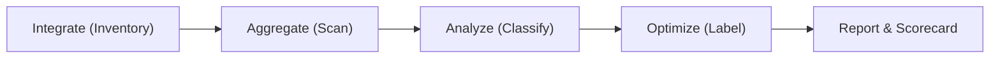

### 3. Distributed Classification Topology
Strategically orchestrating standardized discovery across global data regions, diverse cloud architectures, and multi-cloud targets, providing a unified institutional view of global privacy health and operational readiness.

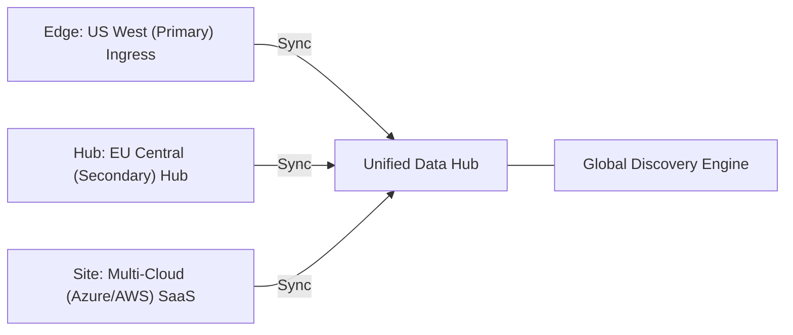

### 4. Classification Governance & High-Trust Data Plane Protection Flow
Executing complex logic for securing the bridge between data owners and privacy teams, ensuring every organizational identity is verified, data-at-rest is protected, and every classification access is according to institutional standards.

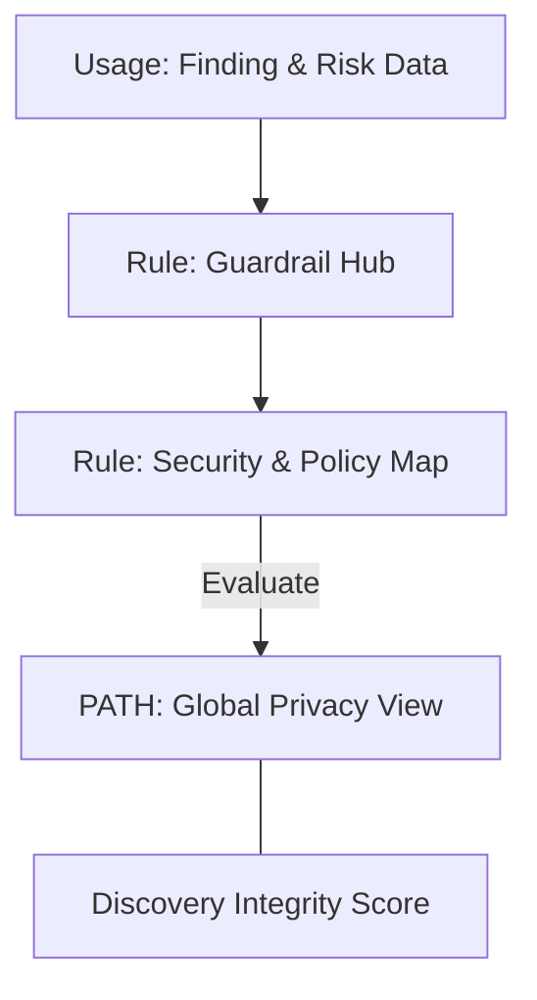

### 5. Multi-Cloud Classification Federation & Governance Flow
Automatically managing unified discovery standards across global regions and diverse cloud tenants, ensuring institutional data residency and privacy boundaries by default.

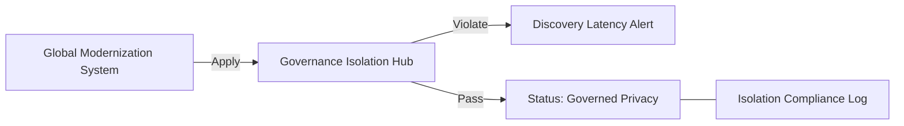

### 6. Encryption & Perimeter Protection Flow (Privacy Standard)
Managing the lifecycle of a classification request, automatically enforcing institutional TLS 1.3 and resource encryption standards as required by security policy, ensuring zero-latency security confidence.

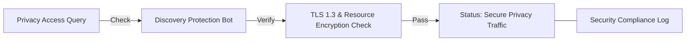

### 7. Institutional Classification Maturity Scorecard
Grading organizational performance based on key indicators: Discovery Coverage Index, Classification Accuracy Index, and Remediation Adoption Scores.

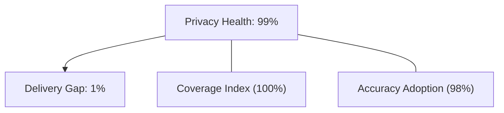

### 8. Identity & RBAC for Privacy Governance
Managing fine-grained access to discovery hubs, provisioning workers, and audit logs between CISOs, Privacy Officers, and SREs.

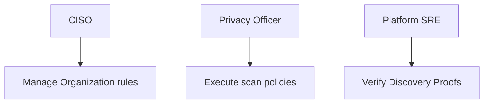

### 9. IaC Deployment: Data-Classification-Engine-as-Code Framework
Using modular Terraform to deploy and manage the versioned distribution of the discovery tracking hubs, classifier protection workers, and forensic metadata lakes.

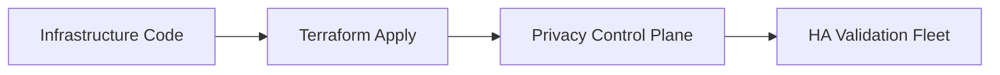

### 10. AIOps Classification Drift & Risk Validation Flow
Using advanced analytics to identify sudden surges in discovery volume, unauthorized classifier changes, suspicious configuration drifts, or unusual delivery pattern changes that could result in institutional risk or data exposure.

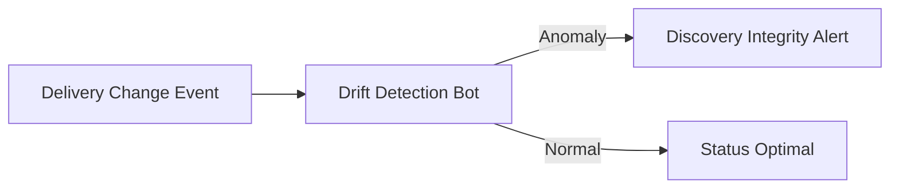

### 11. Metadata Lake for Forensic Privacy Audit
Storing long-term records of every discovery integration event (metadata), every scan executed, and every classification history for institutional record-keeping, compliance auditing, and post-provisioning forensics.

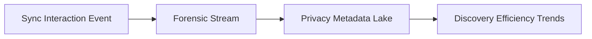

---

## 🏛️ Core Governance Pillars

1.  **Unified Foundation Coordination**: Maximizing resilience by centralizing all discovery measurement through a single institutional plane.
2.  **Automated Privacy Provisioning**: Eliminating "manual labeling" scenarios through proactive orchestration and pattern verification.
3.  **Sequential Scan Intelligence**: Ensuring zero-interruption operations through dependency-aware scan-driven data engineering.
4.  **Zero-Trust Identity Protection**: Automatically enforcing identity-based access, data-at-rest encryption, and policy evaluation across all privacy tiers.
5.  **Autonomous Operations Logic**: Guaranteeing reliability through automated industry-specific effectiveness monitoring runbooks.
6.  **Full Discovery Auditability**: Immutable recording of every classification change and discovery provision for institutional forensics.

---

## 🛠️ Technical Stack & Implementation

### Privacy Engine & APIs
*   **Framework**: Python 3.11+ / FastAPI.
*   **Performance Engine**: Custom Python-based logic for multi-modal NLP discovery and DORA-style privacy metrics.
*   **Integrations**: Native connectors for S3, Blob, SQL, Snowflake, and Databricks.
*   **Persistence**: PostgreSQL (Privacy Ledger) and Redis (Live Scan State).
*   **Auth Orchestrator**: Federated OIDC/SAML for least-privilege privacy management access.

### Governance Dashboard (UI)
*   **Framework**: React 18 / Vite.
*   **Theme**: Dark, Slate, Indigo (Modern high-fidelity productivity aesthetic).
*   **Visualization**: D3.js for discovery topologies and Recharts for accuracy velocity analytics.

### Infrastructure & DevOps
*   **Runtime**: AWS EKS or Azure Kubernetes Service (AKS) for management plane.
*   **Measurement Hub**: Managed event sourcing for immutable productivity timeline reconstruction.
*   **IaC**: Modular Terraform for deploying the privacy landing zone and validation fleet.

---

## 🏗️ IaC Mapping (Module Structure)

| Module | Purpose | Real Services |
| :--- | :--- | :--- |
| **`infrastructure/privacy_hub`** | Central management plane | EKS, PostgreSQL, Redis |
| **`infrastructure/enforcers`** | Distributed discovery provisioners | Azure, AWS, GCP APIs |
| **`infrastructure/scan_pipes`** | Data Ingestion Hubs | Webhooks, Lambda |
| **`infrastructure/auditing`** | Forensic modernization sinks | S3, Athena, Quicksight |

---

## 🚀 Deployment Guide

### Local Principal Environment
```bash
# Clone the Data Classification Engine repository
git clone https://github.com/devopstrio/data-classification-engine.git
cd data-classification-engine

# Configure environment
cp .env.example .env

# Launch the Privacy stack
make init

# Trigger a mock discovery update and automated guardrail validation simulation
make simulate-classification
```

Access the Management Portal at `http://localhost:3000`.

---

## 📜 License
Distributed under the MIT License. See `LICENSE` for more information.

---
<div align="center">
  <p>© 2026 Devopstrio. All rights reserved.</p>
</div>
