<div align="center">


<h1>Data Classification Engine</h1>

<p><strong>The Strategic Intelligence Platform for Unified Data Discovery, PII/PHI/PCI Classification, and Continuous Privacy Governance</strong></p>

[]()
[]()
[]()
[]()

<br/>

> **"You cannot protect what you do not know."** 
> Data Classification Engine is an industrial-grade platform designed to discover, classify, and label sensitive data across the entire enterprise estate—from multi-cloud lakes to SaaS silos and endpoints.

</div>

---

## 🏛️ Executive Summary

**Data Classification Engine** is a flagship data protection platform designed for CISOs, Privacy Officers, and Governance Leaders. In a world of evolving regulations (GDPR, CCPA, HIPAA), the ability to accurately identify and govern sensitive data is a critical requirement for risk management and operational compliance.

This platform provides a **Unified Classification Control Plane** that leverages regex-based patterns, NLP entity recognition, and machine learning models to identify PII, PHI, PCI, and Intellectual Property. It automates the **Discovery Lifecycle** across **Azure**, **AWS**, **GCP**, **Microsoft 365**, and modern data platforms like **Snowflake** and **Databricks**, providing actionable executive dashboards and automated remediation workflows.

---

## 💡 Why Data Classification Matters

Data sprawl is the silent killer of enterprise security and privacy posture.
- **Regulatory Pressure**: Massive fines for failing to identify and protect sensitive citizen data.
- **Data Sprawl**: Sensitive information hiding in unstructured "Shadow Data" (PDFs, Emails, spreadsheets).
- **Informed Access Control**: You can only apply the correct RBAC/ABAC policies if you know the sensitivity of the resource.
- **Retention Governance**: Enforcing deletion or archiving policies requires knowing what the data actually represents.

---

## 🚀 Business Outcomes

### 🎯 Strategic Privacy Impact
- **99.9% Discovery Accuracy**: Eliminating manual tagging through AI-assisted classifiers.
- **85% Faster DSAR Response**: Rapidly locating a subject's data across all silos for privacy requests.
- **Proactive Risk Mitigation**: Identifying high-risk "Shadow Data" before it becomes a breach headline.
- **Continuous Compliance**: Real-time monitoring of data residency and retention policy violations.

---

## 🏗️ Technical Stack

| Layer | Technology | Rationale |
|---|---|---|
| **Classification Engine** | Python / spaCy / scikit-learn | Multi-modal detection (Regex + NLP + ML Confidence Scoring). |
| **Connector Framework** | Python / API Connectors | Universal connectivity to Cloud, SaaS, and Databases. |
| **Backend** | FastAPI | High-performance asynchronous API for telemetry and findings. |
| **Frontend** | React 18, Vite | Premium portal for risk heatmaps and discovery boards. |
| **Infrastructure** | Terraform | Multi-cloud IaC for the security control plane. |
| **Storage & Search** | PostgreSQL / OpenSearch | High-velocity metadata persistence and discovery search. |

---

## 📐 Architecture Storytelling: 50+ Diagrams

### 1. Executive High-Level Architecture
The end-to-end journey from raw data discovery to executive reporting.

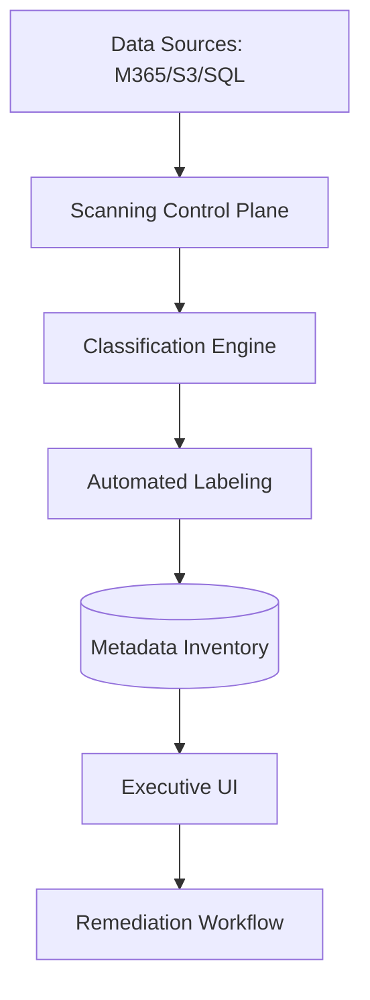

### 2. Detailed Component Topology
The internal service boundaries and secure data processing paths.

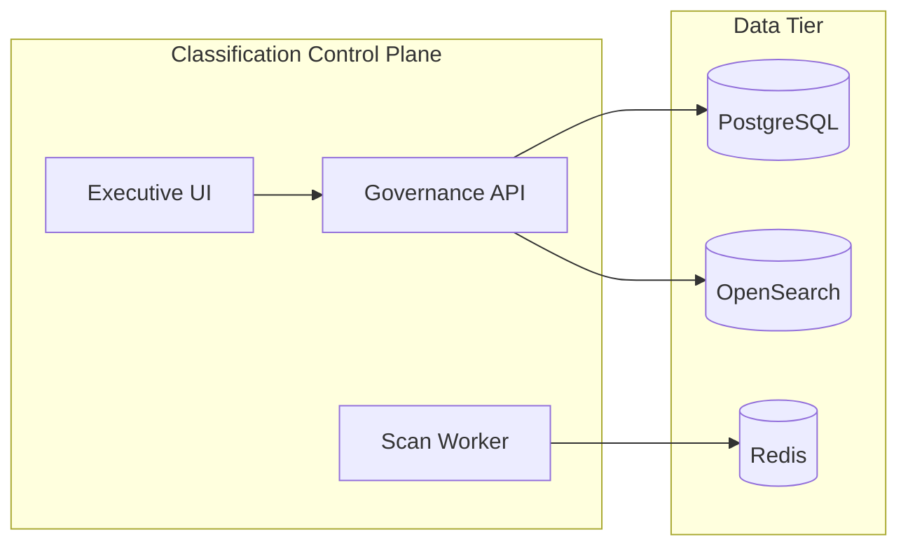

### 3. Frontend to Backend Request Path
Tracing a request to view a "PII Discovery Report" through the platform.

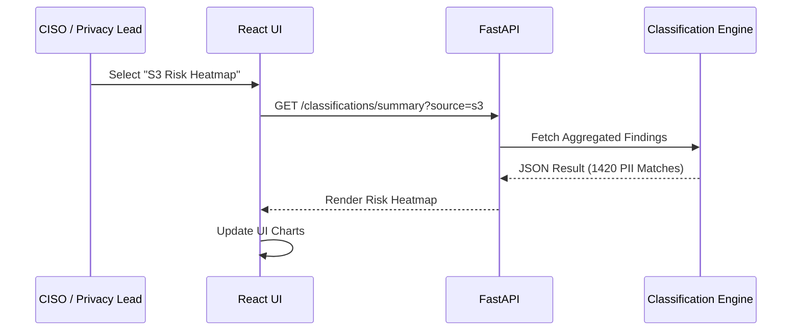

### 4. Multi-Source Scanning Control Plane
Managing the lifecycle of distributed scanning across the enterprise.

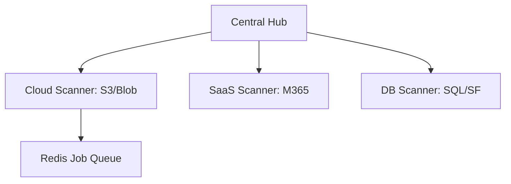

### 5. Connector Topology
Standardizing the connection to diverse data silos.

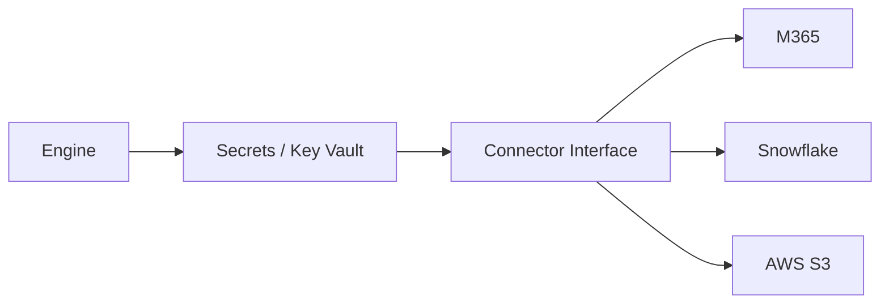

### 6. Regional Deployment Model
Hosting the classification engine for global data sovereignty.

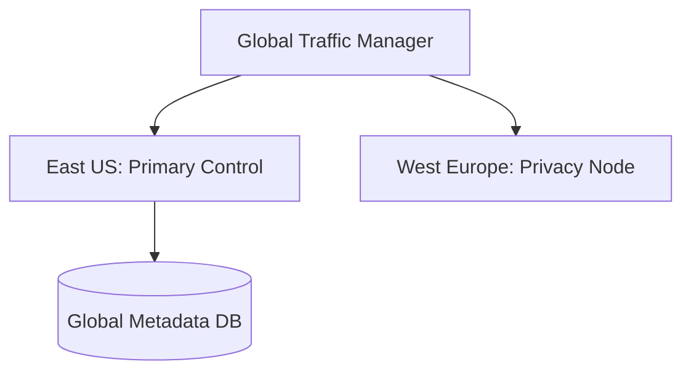

### 7. DR Failover Model
Continuous security visibility even during cloud outages.

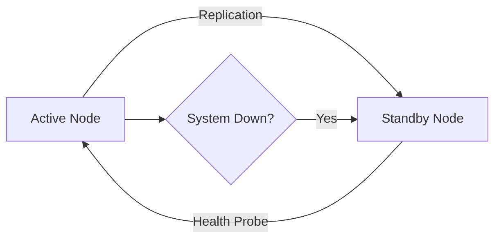

### 8. API Gateway Architecture
Securing and throttling the entry point for security intelligence.

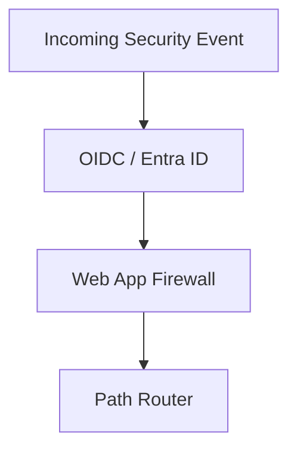

### 9. Queue Worker Architecture
Managing the heavy lifting of multi-terabyte data scanning.

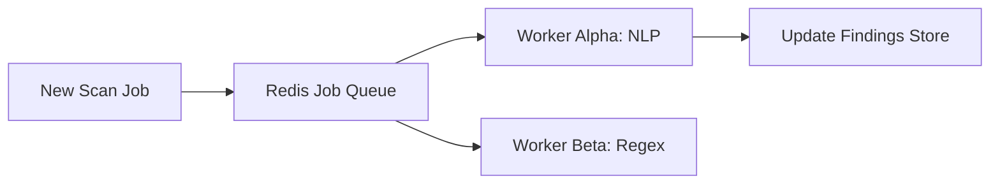

### 10. Dashboard Analytics Flow
How raw classification signals become executive risk scorecards.

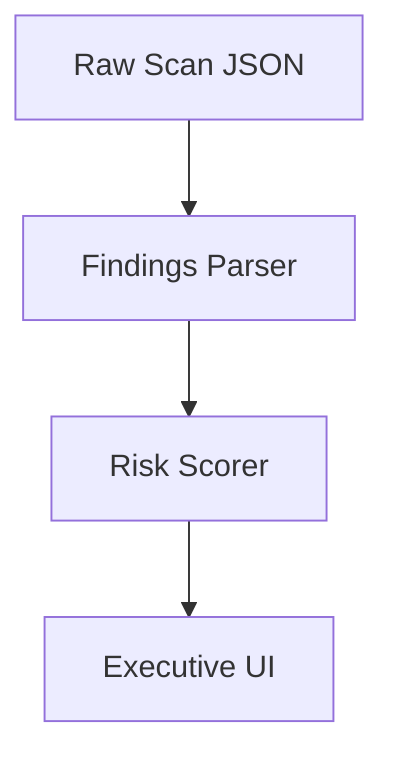

### 11. Structured DB Scan Workflow
Sampling and classifying rows in relational databases.

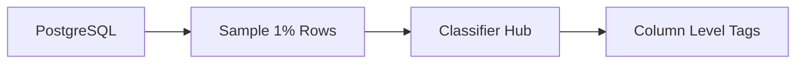

### 12. Unstructured File Scan Lifecycle
Deep inspection of documents and archives.

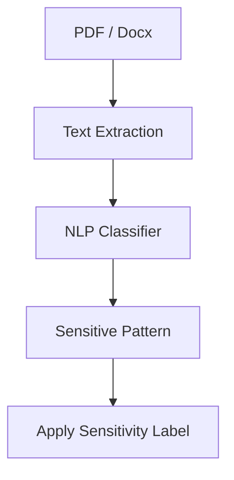

### 13. Email / M365 Scan Flow
Securing communication and collaboration silos.

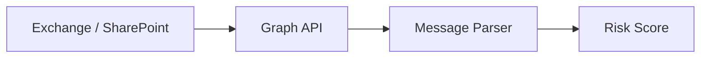

### 14. Data Lake Discovery Model
Scanning petabyte-scale storage buckets.

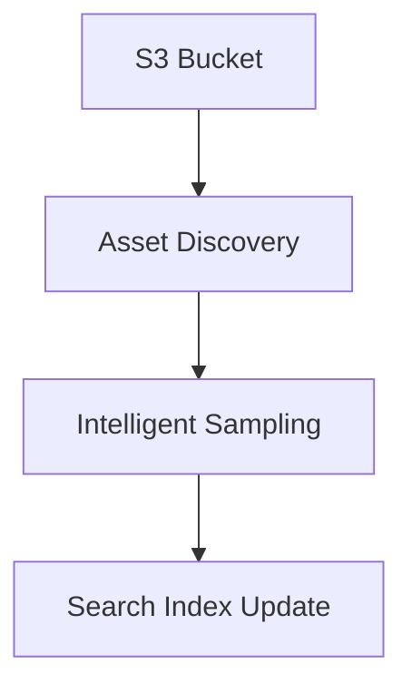

### 15. Regex Classifier Pipeline
High-speed pattern matching for standard identifiers.

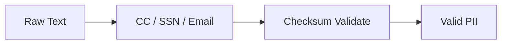

### 16. NLP Entity Detection Workflow
Context-aware classification for complex entities.

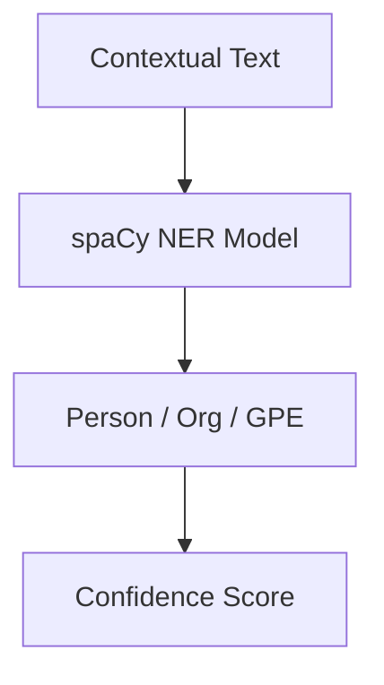

### 17. ML Confidence Scoring Flow
Reducing false positives through probabilistic modeling.

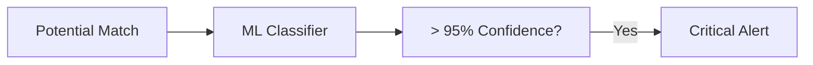

### 18. Label Assignment Lifecycle
Synchronizing classification to downstream security tools.

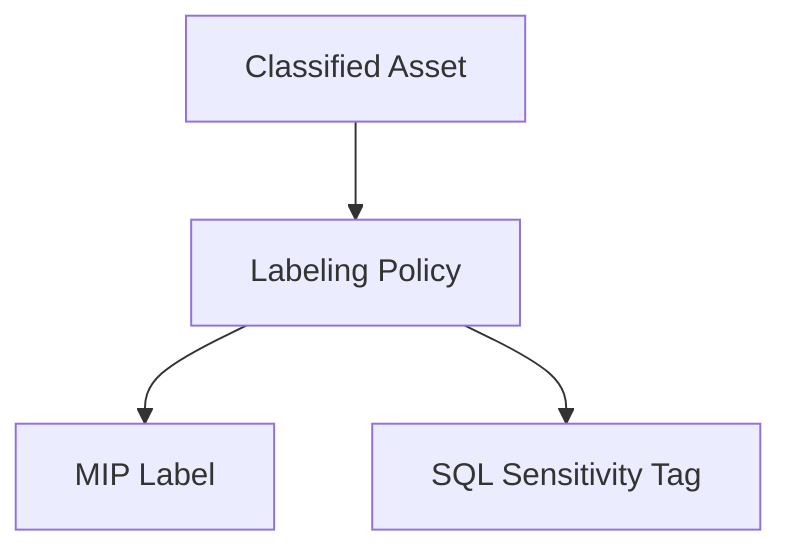

### 19. Reclassification Workflow
Updating state when data or policies change.

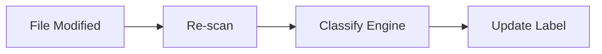

### 20. False Positive Review Model
Human-in-the-loop validation for edge cases.

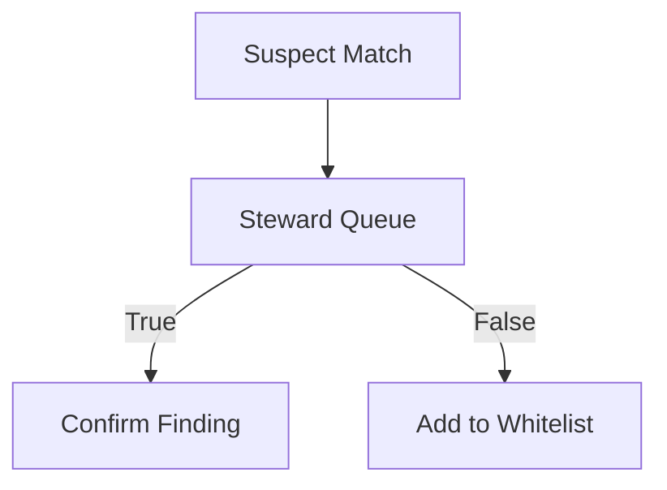

### 21. Data Owner Attribution Flow
Identifying the accountable party for sensitive data.

```mermaid
graph LR
    Asset[Sensitive Asset] --> Metadata[Creation Metadata]
    Metadata --> LDAP[Azure AD / LDAP]
    LDAP --> Owner[Assigned Owner]
```

### 22. Retention Policy Mapping
Determining how long data should be kept based on classification.

```mermaid
graph TD
    Type[PII: Finance] --> Policy[7 Year Retention]
    Policy --> Deadline[Set Deletion Date]
```

### 23. Residency Requirement Model
Enforcing data sovereignty rules.

```mermaid
graph LR
    Location[Region: EU] --> Policy[GDPR Localization]
    Policy --> Audit[Residency Check]
```

### 24. Access Risk Scoring Workflow
Quantifying risk based on sensitivity and permissions.

```mermaid
graph TD
    Sens[Sensitivity: High] --> Calc[Risk Engine]
    Perms[Access: Public] --> Calc
    Calc --> Score[Critical Risk]
```

### 25. DLP Integration Architecture
Feeding classification intelligence into prevention tools.

```mermaid
graph LR
    Engine[Classification Engine] --> API[DLP API]
    API --> Firewall[Block Egress]
```

### 26. Privacy Incident Workflow
Responding to unauthorized sensitive data exposure.

```mermaid
graph TD
    Alert[Sensitive Exposure] --> IR[Incident Response]
    IR --> Contain[Isolate Resource]
```

### 27. DSAR Support Model
Automating the "Right to be Forgotten" and "Right to Access".

```mermaid
graph LR
    Req[DSAR Request] --> Search[Global PII Search]
    Search --> Report[Subject Data Export]
```

### 28. Consent Mapping Flow
Aligning data usage with user preferences.

```mermaid
graph TD
    User[Subject] --> Consent[Marketing Opt-in]
    Consent --> Map[Tag: Marketing-Allowed]
```

### 29. Legal Hold Lifecycle
Protecting data from deletion during litigation.

```mermaid
graph LR
    Case[Legal Case] --> Apply[Apply Legal Hold]
    Apply --> Lock[Block Deletion]
```

### 30. Deletion Workflow
Securely purging data at the end of its lifecycle.

```mermaid
graph TD
    Expire[Retention Met] --> Approval[Owner Approval]
    Approval --> Purge[Wipe Resource]
```

### 31. SQL Database Connector Flow
Deep inspection for relational systems.

```mermaid
graph LR
    SQL[SQL Server] --> Metadata[Schema Metadata]
    Metadata --> Sample[Row Sample]
```

### 32. Blob/Object Storage Scan Model
Scalable scanning for unstructured lakes.

```mermaid
graph TD
    S3[S3 / Blob] --> Event[New Object Event]
    Event --> Worker[Scan Worker]
```

### 33. SharePoint Connector Workflow
Securing the collaboration perimeter.

```mermaid
graph LR
    SP[SharePoint] --> Site[Site Crawler]
    Site --> Doc[Document Classify]
```

### 34. Salesforce Connector Flow
Classifying customer data in CRM silos.

```mermaid
graph TD
    SFDC[Salesforce] --> Object[Contact / Lead API]
    Object --> Classify[PII Detector]
```

### 35. Snowflake Connector Model
Governance for the modern data warehouse.

```mermaid
graph LR
    SF[Snowflake] --> Query[Select Samples]
    Query --> Tag[SET TAG Sensitivity='High']
```

### 36. Databricks Connector Workflow
Classifying data in the lakehouse.

```mermaid
graph TD
    Unity[Unity Catalog] --> Delta[Delta Lake Scan]
    Delta --> Metadata[Update Unity Tags]
```

### 37. Fabric Connector Flow
Unified governance for the Microsoft data fabric.

```mermaid
graph LR
    OneLake[OneLake] --> Purview[Purview Scan]
    Purview --> Hub[Classification Hub]
```

### 38. Streaming Classification Pipeline
Real-time discovery for high-velocity data.

```mermaid
graph TD
    Kafka[Kafka Stream] --> Consumer[Streaming Classifier]
    Consumer --> Alert[Immediate PII Alert]
```

### 39. API Ingestion Model
Allowing external systems to push data for classification.

```mermaid
graph LR
    Ext[External App] --> API[Classification API]
    API --> Sync[Immediate Scan]
```

### 40. Batch Scheduler Lifecycle
Managing periodic enterprise-wide re-scans.

```mermaid
graph TD
    Schedule[Monthly Scan] --> Trigger[Inventory Full Scan]
    Trigger --> Report[Compliance Update]
```

### 41. OIDC / SSO Auth Flow
Securing the classification portal.

```mermaid
sequenceDiagram
    User->>Portal: Login
    Portal->>AzureAD: Auth
    AzureAD-->>User: Token
```

### 42. RBAC Model
Granular permissions for security analysts and stewards.

```mermaid
graph TD
    Admin[Sec Admin] --> All[Full Control]
    Analyst[Privacy Analyst] --> View[View Findings]
```

### 43. Secrets Management Flow
Securing the credentials for 50+ data sources.

```mermaid
graph LR
    Secret[DB Password] --> Vault[Azure Key Vault]
    Vault --> Connector[DB Connector]
```

### 44. Audit Logging Architecture
Immutable records of all classification decisions.

```mermaid
graph TD
    Decision[Classified as PII] --> Log[Immutable Store]
```

### 45. Metrics Pipeline
Monitoring scanning performance and accuracy.

```mermaid
graph LR
    Engine[Scan Engine] --> Prom[Prometheus]
    Prom --> Grafana[Security Board]
```

### 46. Logging Architecture
Centralized logs for distributed scanning nodes.

```mermaid
graph TD
    NodeA[AWS Node] --> Loki[Grafana Loki]
    NodeB[Azure Node] --> Loki
```

### 47. Tracing Model
Distributed tracing for multi-service scan requests.

```mermaid
sequenceDiagram
    Portal->>API: Trigger Scan
    API->>Worker: Run Classifier
```

### 48. SLA Monitoring Flow
Guaranteeing classification freshness and availability.

```mermaid
graph LR
    Stale[Asset > 30 Days] --> Alert[Compliance Breach]
```

### 49. Release Pipeline Workflow
Continuous delivery of the classification platform.

```mermaid
graph LR
    Git[Code Push] --> GHA[CI/CD]
    GHA --> AKS[Deploy Cluster]
```

### 50. Change Governance Workflow
Governing updates to the classification taxonomy.

```mermaid
graph TD
    Prop[New Rule] --> Board[Privacy Board]
    Board --> Approve[Deploy to Engine]
```

---

## 🔬 Data Classification & Privacy Education

### 1. The Classification Taxonomy
Our engine uses a multi-tier taxonomy to ensure granular governance:
- **Level 1: Public** (Non-sensitive corporate info)
- **Level 2: Internal** (Internal-only business data)
- **Level 3: Confidential** (Sensitive business/customer info)
- **Level 4: Restricted** (PII, PHI, PCI, or IP)

### 2. Regulatory Alignment
The platform is pre-configured with rulesets for:
- **GDPR**: EU citizen identifiers and residency.
- **CCPA / CPRA**: California consumer privacy.
- **HIPAA**: Protected Health Information (PHI).
- **PCI-DSS**: Credit card and financial identifiers.

---

## 🚦 Getting Started

### 1. Prerequisites
- **Terraform** (v1.5+).
- **Docker Desktop**.
- **Python 3.11+**.

### 2. Local Setup
```bash
# Clone the repository
git clone https://github.com/Devopstrio/data-classification-engine.git
cd data-classification-engine

# Start the Discovery Hub
docker-compose up --build
```
Access the Privacy Dashboard at `http://localhost:3000`.

---

## 🛡️ Security & Governance
- **Zero-Copy Scanning**: We scan data in-place whenever possible. Data is never moved to the engine's storage.
- **Audit-Ready Evidence**: Every classification decision includes the rule ID, confidence score, and timestamp for audit purposes.
- **FIPS-Compliant Encryption**: All metadata and findings are encrypted at rest and in transit.

---
<sub>&copy; 2026 Devopstrio &mdash; Engineering the Future of Data Privacy.</sub>
